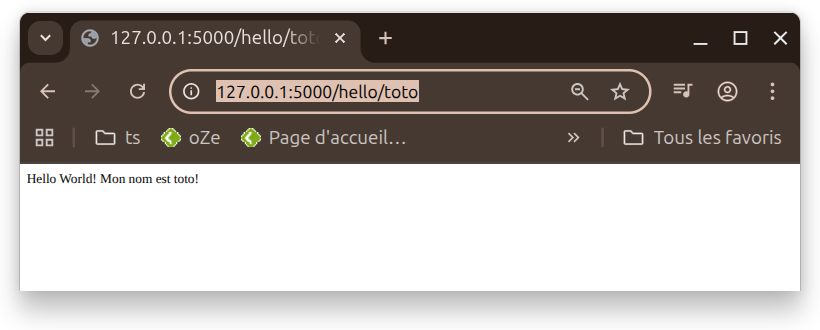
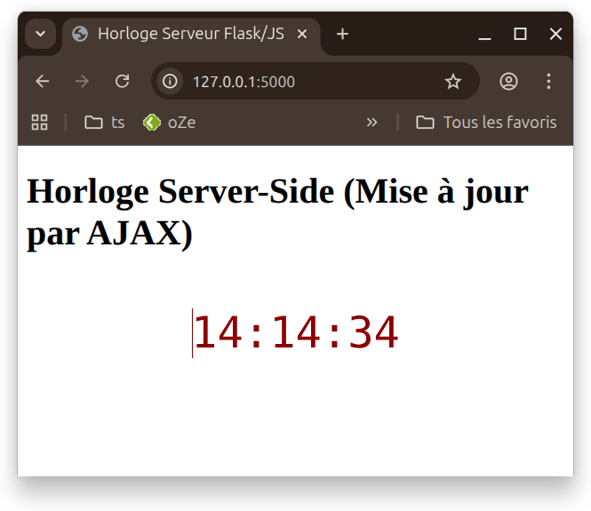
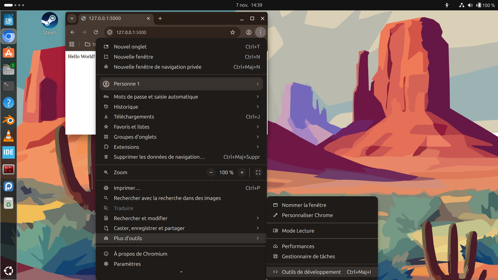

# Exemple utilisation de flask

## Préalable

Pour installer une version de python tu peux installer directement cette distribution qui intègre python avec un installateur dédié pour les librairies spécifique comme `flask` <https://repo.anaconda.com/archive/Anaconda3-2025.06-0-MacOSX-x86_64.pkg>.

Ensuite on peut installer dans un terminal la librairie `flask` avec la commande (on doit voir `base` en début de chaque prompt maintenant, l'environnement python anaconda est chargée) :

``` bash
conda install anaconda::flask
```

Puis on télécharge ce dépot sous la forme d'un zip et on lance les exemples les exemples du répertoire `code`.

## Simple server web

### Premier test avec une simple page web

Il suffit ensuite de créer un script python dans le répertoire avec le nom \`simple_server.py\`.

``` python
from flask import Flask

# Crée une instance de l'application Flask
app = Flask(__name__)

# Définit l'itinéraire pour la page d'accueil (/)
@app.route('/')
def hello_world():
    # Renvoie la chaîne à afficher sur la page web
    return 'Hello World!'

# Exécute l'application si le script est lancé directement
if __name__ == '__main__':
    app.run(debug=True)
```

On exécute le script avec la commande suivante :

``` bash
python simple_server.py
```

Voila le résultat dans le terminal, si on se connecte sur un explorateur à l'adresse [127.0.0.1:5000](127.0.0.1:5000) :

``` bash
 * Serving Flask app 'simple_server'
 * Debug mode: on
WARNING: This is a development server. Do not use it in a production deployment. Use a production WSGI server instead.
 * Running on http://127.0.0.1:5000
Press CTRL+C to quit
 * Restarting with stat
 * Debugger is active!
 * Debugger PIN: 880-304-128
127.0.0.1 - - [07/Nov/2025 13:26:11] "GET / HTTP/1.1" 200 -
127.0.0.1 - - [07/Nov/2025 13:27:00] "GET /favicon.ico HTTP/1.1" 404 -
```

L'affichage dans l'explorateur est le suivant :

{fig-align="center"}

### Analyse des message délivrés par python

|  |  |  |
|------------------------|------------------------|------------------------|
| **Composant** | **Ligne 1 : Requête Réussie (GET /)** | **Ligne 2 : Icône Manquante (GET /favicon.ico)** |
| **`127.0.0.1`** | **Adresse IP** du client (votre ordinateur, `localhost`). | **Adresse IP** du client (votre navigateur). |
| **`[Date/Heure]`** | L'heure de la requête : **`07/Nov/2025 13:26:11`**. | L'heure de la requête : **`07/Nov/2025 13:27:00`**. |
| **Méthode/URL** | **`"GET / HTTP/1.1"`** : Demande de la page d'accueil (URL racine). | **`"GET /favicon.ico HTTP/1.1"`** : Demande automatique de l'**icône du site** (le petit logo dans l'onglet). |
| **Code Statut** | **`200`** : **OK** (Succès). La page a été trouvée et renvoyée (votre "Hello World!"). | **`404`** : **Non trouvé** (Not Found). Le fichier `favicon.ico` n'existe pas dans l'application. |
| **Taille** | **`-`** : La taille de la réponse (non enregistrée). | **`-`** : La taille de la réponse (non enregistrée). |

### Comment cela fonctionne

L'explorateur va chercher à l'adresse local [127.0.0.1:5000](127.0.0.1:5000).

Le programme python va donc aller dans le code correspond à la racine ici définit par la ligne `@app.route('/')` et renvoyer à l'explorateur le contenu de la fonction `hello_world`qui est `return 'Hello World!'`.

## Ajout d'un prénom à coté de helloworld

On va créer un nouveau code appellé `helloworld_name.py`\`:

``` python
from flask import Flask

# Crée une instance de l'application Flask
app = Flask(__name__)

# --- MODIFICATION CLÉ ---
# Définit une route qui accepte une variable 'name'
# La variable est entre < > et son type par défaut est string
@app.route('/hello/<name>')
def hello_name(name):
    # La fonction reçoit la valeur de l'URL comme argument 'name'
    # Elle renvoie la chaîne formatée
    return f'Hello World! Mon nom est {name}!'

# Route par défaut (si aucun nom n'est fourni)
@app.route('/')
def hello_default():
    return 'Hello World!'

# Exécute l'application
if __name__ == '__main__':
    app.run(debug=True)
```

On lance le programme de la même manière :

``` bash
python helloworld_name.py
```

Si on ouvre la page web à l'adresse <http://127.0.0.1:5000/hello/toto>, on obtient :



Si on ouvre à nouveau à l'adresse [127.0.0.1:5000](127.0.0.1:5000), on retrouve notre simple helloworld :

{fig-align="center"}

## Un code avec du javascript pour faire un peu plus dynamique

Le code est composé d'un programme python `heure.py`\`:

``` python
from flask import Flask, render_template, jsonify
from datetime import datetime

app = Flask(__name__)

# Route principale pour afficher la page
@app.route('/')
def index():
    return render_template('index.html')

# Nouvelle route API pour fournir l'heure du serveur
@app.route('/time_update')
def time_update():
    # Récupère l'heure actuelle du serveur
    now = datetime.now()
    
    # Formate l'heure comme une chaîne de caractères (ex: 14:06:47)
    current_time = now.strftime("%H:%M:%S")
    
    # Retourne l'heure formatée en tant que JSON
    # C'est la réponse que le JavaScript recevra.
    return jsonify(time=current_time)

if __name__ == '__main__':
    # Le mode debug permet de redémarrer automatiquement le serveur
    app.run(debug=True)
```

et d'un fichier html enregistré dans ./templates `index.html` :

``` html
<!DOCTYPE html>
<html lang="fr">
<head>
    <meta charset="UTF-8">
    <title>Horloge Serveur Flask/JS</title>
    <style>
        #horloge {
            font-size: 3em;
            font-family: monospace;
            text-align: center;
            margin-top: 50px;
            color: darkred; /* Pour différencier de la version JS client */
        }
    </style>
</head>
<body>

    <h1>Horloge - requete envoyé par du javascript à la partie python par la commande fetch à l'adresse time_update</h1>
    <div id="horloge">Connexion au serveur...</div>

    <script>
        // Fonction qui va chercher l'heure auprès du serveur Flask
        function fetchServerTime() {
            // Utilisation de l'API fetch (moderne) pour faire une requête GET
            fetch('/time_update')
                .then(response => {
                    // Vérifie si la réponse est OK (statut HTTP 200)
                    if (!response.ok) {
                        throw new Error('Erreur réseau ou du serveur');
                    }
                    // Parse la réponse JSON
                    return response.json();
                })
                .then(data => {
                    // Met à jour l'élément HTML avec la valeur 'time' reçue du JSON
                    document.getElementById('horloge').innerHTML = data.time;
                })
                .catch(error => {
                    console.error('Erreur lors de la récupération de l\'heure :', error);
                    document.getElementById('horloge').innerHTML = "Erreur de connexion !";
                });
        }

        // 1. Appel immédiat au chargement de la page
        fetchServerTime();

        // 2. Met à jour l'heure toutes les 1000 millisecondes (1 seconde) en refaisant un appel au serveur
        setInterval(fetchServerTime, 1000);
    </script>

</body>
</html>
```

On lance toujours l'application avec :

``` bash
python heure.py
```

Et on ouvre l'explorateur à l'adresse [127.0.0.1:5000](127.0.0.1:5000). on obtient :



On constate que l'heure change toute les secondes, la partie client (dans l'explorateur) fait une requête toutes les secondes à la partie serveur python avec la fonction du code `index.html` :

```         
    setInterval(fetchServerTime, 1000);
```

**setInterval** est une fonction javascript qui prend comme argument une fonction (ici **fetchServerTime**) et un temps (**1000**):

-   **fetchServerTime** fonction qui recupere l'heure à l'adresse  [127.0.0.1:5000/time_update](127.0.0.1:5000/time_update) grâce à la fonction javascript `fetch`.
-   **1000** est le timeout qui permet de repéter le lancement de la fonction **fetchServerTime** toutes les secondes.

D'ailleurs si on va à l'adresse [127.0.0.1:5000/time_update](127.0.0.1:5000/time_update), on voit ceci :


On voit que la partie python renvoie l'heure sous la forme d'un json (même principe qu'un fichier de configuration xml).

Si on regarde dans le terminal, on constate que toutes les secondes le serveur python renvoie l'heure à la partie client. L'adresse `@app.route('/time_update')` est la relation entre l'adresse appelé par le client et le programe associé `def time_update():`.

En python \@ est un décorateur de fonction mais c'est pas souvent utilisé mais dans le cadre de flask cela permet d'accrocher une adresse par exemple time_update à la fonction time_update.

Cette exemple a montré comment fonctionne une communication entre le client (explorateur) et la partie serveur (python-flask) sans avoir à recharger la page.

## Généralité

### Esthétique

Pour rendre un site esthétique, on utilise des fichiers `css`qui permet d'améliorer l'apparence. Si le css est dans le code il est contenu entre les balises styles sinon c'est un fichier à côté, exemple de code avec du css contenu dans les balises styles `test.html`\` :

``` html
<!DOCTYPE html>
<html lang="fr">
<head>
    <meta charset="UTF-8">
    <meta name="viewport" content="width=device-width, initial-scale=1.0">
    <title>Exemple HTML et CSS Simple</title>

    <style>
        /* S'applique à tous les éléments <h1> */
        h1 {
            color: blue; /* Définit la couleur du texte en bleu */
            text-align: center; /* Centre le texte */
            border-bottom: 2px solid lightgray; /* Ajoute une ligne de séparation */
            padding-bottom: 10px;
        }

        /* S'applique à l'élément avec l'ID 'paragraphe-style' */
        #paragraphe-style {
            background-color: #f0f0f0; /* Fond gris très clair */
            padding: 15px;
            border-radius: 5px; /* Coins arrondis */
        }
    </style>
</head>
<body>

    <h1>Mon Premier Exemple de Page Web</h1>

    <p id="paragraphe-style">
        Ce paragraphe utilise les règles CSS définies dans la balise **&lt;style&gt;** (CSS Interne) pour son fond, ses marges internes et ses coins.
    </p>

    <p style="color: green; font-weight: bold;">
        Ce deuxième paragraphe utilise le **CSS En Ligne**. L'attribut 'style' est placé directement dans la balise &lt;p&gt; pour rendre le texte **vert** et en **gras**.
    </p>

</body>
</html>
```

Il y a plein de framework (librairies) qui permettent de faire du html jolie comme par exemple *bootstrap*.

### Fonctionnalités avancées en javascript

Le javascript n'est pas un langague très agréable, il a donc été développé des librairies plus hauts niveaux basées sur du javascript pout simplifier la programmation, historiquement on avait jquery mais qui devient obscolète. Maintenant on utilise plutôt `React` (développé au départ par facebook pour ses besoins) ou `vue.js`.

### Comprendre le fonctionnement client en utilisant les outils

Dans chrome ou firefox il y a des outils d'analyse du site web et des echanges, tu as même une console qui permet d'interargir avec la page.



Dans cette page, on voit les requetes toutes secondes aux serveurs :


### Video pour installer anaconda

[](https://www.youtube.com/watch?v=nSS_uGjwDDA)